# AppClipsStudio Architecture Overview

Visual representation of AppClipsStudio's comprehensive App Clip development framework and component interactions.

## 🏗️ System Architecture Overview

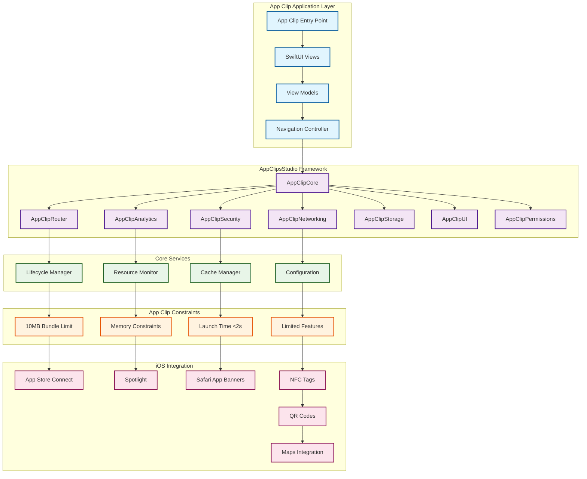

## 🔄 App Clip Lifecycle Flow

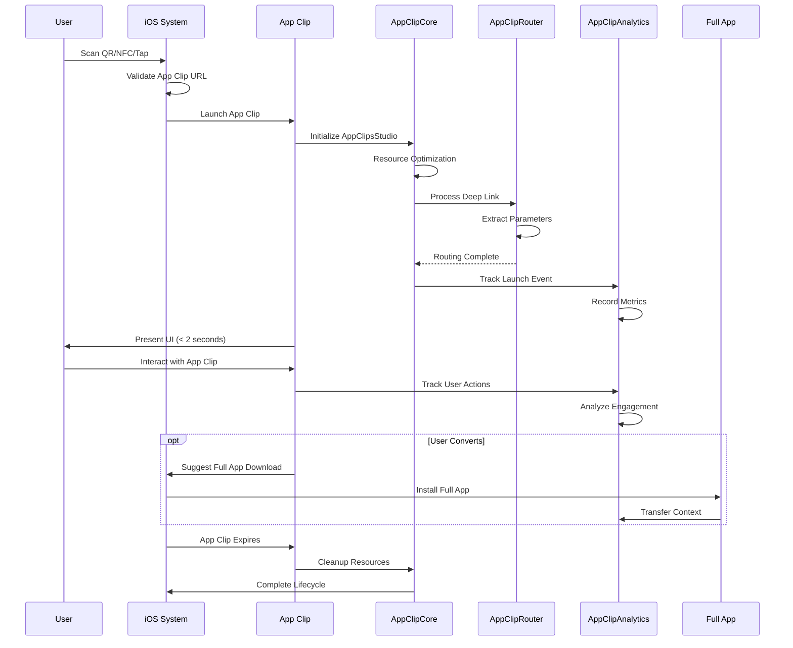

## 📦 Module Architecture

```mermaid
graph TB
    subgraph "AppClipCore Module"
        CORE_INIT[Initialization]
        CORE_CONFIG[Configuration]
        CORE_LIFECYCLE[Lifecycle Management]
        CORE_RESOURCE[Resource Monitoring]
    end
    
    subgraph "AppClipRouter Module"
        ROUTER_DEEP[Deep Link Processing]
        ROUTER_PARAM[Parameter Extraction]
        ROUTER_NAV[Navigation Management]
        ROUTER_STATE[State Restoration]
    end
    
    subgraph "AppClipAnalytics Module"
        ANALYTICS_TRACK[Event Tracking]
        ANALYTICS_METRICS[Performance Metrics]
        ANALYTICS_ENGAGE[Engagement Analysis]
        ANALYTICS_CONVERT[Conversion Tracking]
    end
    
    subgraph "AppClipSecurity Module"
        SECURITY_VALIDATE[Request Validation]
        SECURITY_ENCRYPT[Data Encryption]
        SECURITY_AUTH[Authentication]
        SECURITY_PRIVACY[Privacy Protection]
    end
    
    subgraph "AppClipNetworking Module"
        NET_HTTP[HTTP Client]
        NET_CACHE[Response Caching]
        NET_RETRY[Retry Logic]
        NET_COMPRESS[Data Compression]
    end
    
    subgraph "AppClipStorage Module"
        STORAGE_LOCAL[Local Storage]
        STORAGE_KEYCHAIN[Keychain Access]
        STORAGE_TEMP[Temporary Data]
        STORAGE_SYNC[Data Synchronization]
    end
    
    subgraph "AppClipUI Module"
        UI_COMPONENTS[UI Components]
        UI_THEMES[Theming System]
        UI_ANIMATIONS[Animations]
        UI_ACCESSIBILITY[Accessibility]
    end
    
    subgraph "AppClipPermissions Module"
        PERM_REQUEST[Permission Requests]
        PERM_MANAGE[Permission Management]
        PERM_STATUS[Status Monitoring]
        PERM_FALLBACK[Fallback Handling]
    end
    
    CORE_INIT --> ROUTER_DEEP
    CORE_CONFIG --> ANALYTICS_TRACK
    CORE_LIFECYCLE --> SECURITY_VALIDATE
    CORE_RESOURCE --> NET_HTTP
    
    ROUTER_PARAM --> STORAGE_LOCAL
    ROUTER_NAV --> UI_COMPONENTS
    ROUTER_STATE --> PERM_REQUEST
    
    ANALYTICS_METRICS --> NET_CACHE
    ANALYTICS_ENGAGE --> STORAGE_TEMP
    ANALYTICS_CONVERT --> UI_THEMES
    
    SECURITY_ENCRYPT --> STORAGE_KEYCHAIN
    SECURITY_AUTH --> NET_RETRY
    SECURITY_PRIVACY --> PERM_MANAGE
    
    NET_COMPRESS --> STORAGE_SYNC
    UI_ANIMATIONS --> PERM_STATUS
    UI_ACCESSIBILITY --> PERM_FALLBACK
    
    classDef core fill:#e8f5e8,stroke:#2e7d32,stroke-width:2px
    classDef router fill:#e3f2fd,stroke:#1565c0,stroke-width:2px
    classDef analytics fill:#fff3e0,stroke:#ef6c00,stroke-width:2px
    classDef security fill:#ffebee,stroke:#c62828,stroke-width:2px
    classDef networking fill:#f3e5f5,stroke:#7b1fa2,stroke-width:2px
    classDef storage fill:#e0f2f1,stroke:#00695c,stroke-width:2px
    classDef ui fill:#fce4ec,stroke:#ad1457,stroke-width:2px
    classDef permissions fill:#e8eaf6,stroke:#3f51b5,stroke-width:2px
    
    class CORE_INIT,CORE_CONFIG,CORE_LIFECYCLE,CORE_RESOURCE core
    class ROUTER_DEEP,ROUTER_PARAM,ROUTER_NAV,ROUTER_STATE router
    class ANALYTICS_TRACK,ANALYTICS_METRICS,ANALYTICS_ENGAGE,ANALYTICS_CONVERT analytics
    class SECURITY_VALIDATE,SECURITY_ENCRYPT,SECURITY_AUTH,SECURITY_PRIVACY security
    class NET_HTTP,NET_CACHE,NET_RETRY,NET_COMPRESS networking
    class STORAGE_LOCAL,STORAGE_KEYCHAIN,STORAGE_TEMP,STORAGE_SYNC storage
    class UI_COMPONENTS,UI_THEMES,UI_ANIMATIONS,UI_ACCESSIBILITY ui
    class PERM_REQUEST,PERM_MANAGE,PERM_STATUS,PERM_FALLBACK permissions
```

## 🎯 App Clip Discovery & Launch Flow

```mermaid
flowchart TD
    START([User Discovers App Clip]) --> DISCOVERY{Discovery Method}
    
    DISCOVERY -->|QR Code| QR_SCAN[Scan QR Code]
    DISCOVERY -->|NFC Tag| NFC_TAP[Tap NFC Tag]
    DISCOVERY -->|App Banner| BANNER_TAP[Tap Safari Banner]
    DISCOVERY -->|Maps| MAP_TAP[Tap in Maps]
    DISCOVERY -->|Spotlight| SPOTLIGHT_TAP[Search Result]
    
    QR_SCAN --> URL_VALIDATE[Validate App Clip URL]
    NFC_TAP --> URL_VALIDATE
    BANNER_TAP --> URL_VALIDATE
    MAP_TAP --> URL_VALIDATE
    SPOTLIGHT_TAP --> URL_VALIDATE
    
    URL_VALIDATE --> CHECK_INSTALL{App Clip Installed?}
    
    CHECK_INSTALL -->|No| DOWNLOAD[Download App Clip]
    CHECK_INSTALL -->|Yes| LAUNCH[Launch App Clip]
    
    DOWNLOAD --> SIZE_CHECK{Bundle < 10MB?}
    SIZE_CHECK -->|No| ERROR[Download Failed]
    SIZE_CHECK -->|Yes| INSTALL[Install App Clip]
    
    INSTALL --> LAUNCH
    
    LAUNCH --> INIT[Initialize AppClipsStudio]
    INIT --> PROCESS_URL[Process Deep Link URL]
    PROCESS_URL --> LOAD_UI[Load User Interface]
    LOAD_UI --> READY[App Clip Ready]
    
    READY --> USER_INTERACTION[User Interaction]
    USER_INTERACTION --> TRACK[Track Analytics]
    TRACK --> COMPLETE{Task Complete?}
    
    COMPLETE -->|Yes| SUGGEST[Suggest Full App]
    COMPLETE -->|No| USER_INTERACTION
    
    SUGGEST --> DOWNLOAD_FULL{User Downloads?}
    DOWNLOAD_FULL -->|Yes| FULL_APP[Launch Full App]
    DOWNLOAD_FULL -->|No| EXPIRE[App Clip Expires]
    
    FULL_APP --> END([Complete])
    EXPIRE --> END
    ERROR --> END
    
    classDef start fill:#e8f5e8,stroke:#2e7d32,stroke-width:2px
    classDef decision fill:#fff3e0,stroke:#e65100,stroke-width:2px
    classDef process fill:#e3f2fd,stroke:#1565c0,stroke-width:2px
    classDef error fill:#ffebee,stroke:#c62828,stroke-width:2px
    classDef end fill:#f3e5f5,stroke:#7b1fa2,stroke-width:2px
    
    class START,READY start
    class DISCOVERY,CHECK_INSTALL,SIZE_CHECK,COMPLETE,DOWNLOAD_FULL decision
    class QR_SCAN,NFC_TAP,BANNER_TAP,MAP_TAP,SPOTLIGHT_TAP,URL_VALIDATE,DOWNLOAD,INSTALL,LAUNCH,INIT,PROCESS_URL,LOAD_UI,USER_INTERACTION,TRACK,SUGGEST,FULL_APP,EXPIRE process
    class ERROR error
    class END end
```

## 💾 Resource Management Architecture

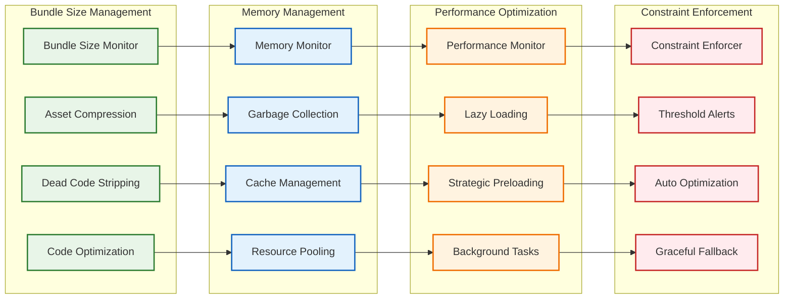

## 🔐 Security & Privacy Architecture

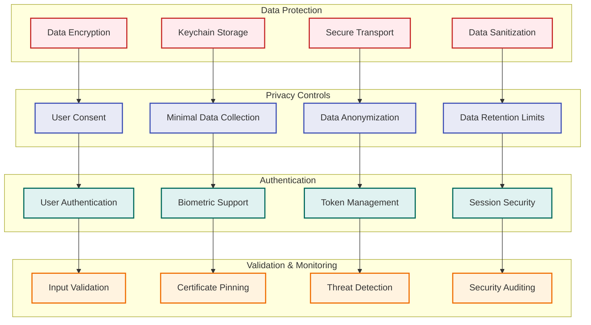

## 📊 Analytics & Telemetry Pipeline

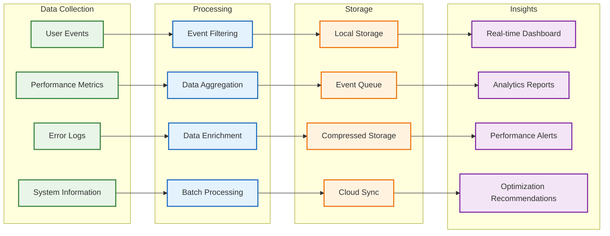

## 🌐 Networking & Caching Strategy

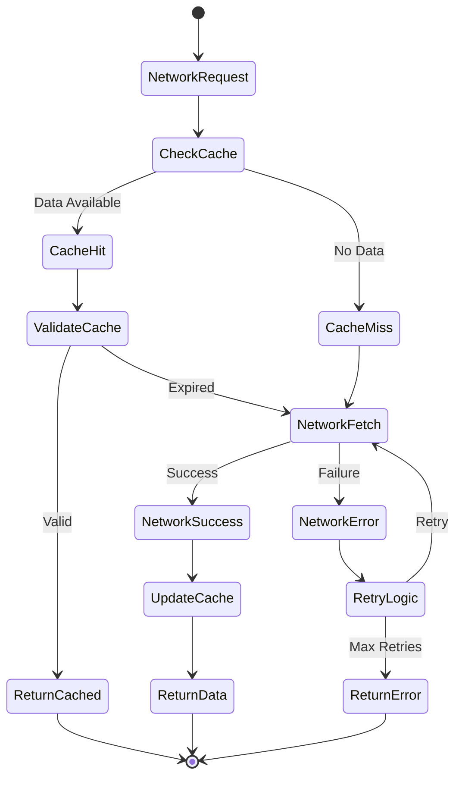

## 🎨 UI Component Architecture

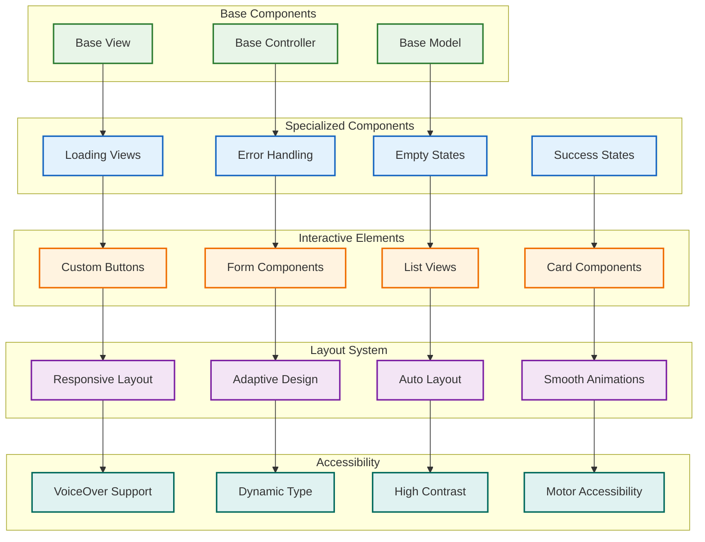

## 🔄 State Management Flow

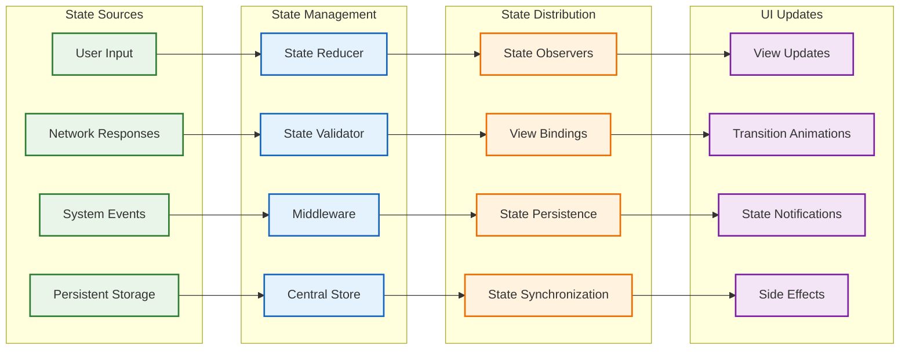

## 📱 App Clip Integration Points

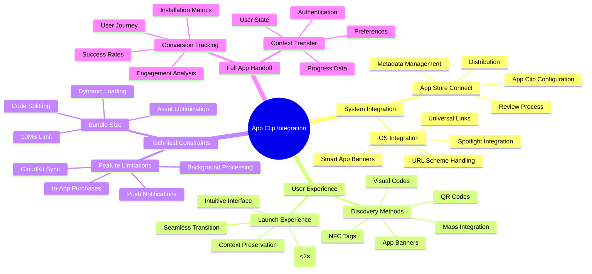

## ⚡ Performance Optimization Flow

```mermaid
graph TB
    START([App Clip Launch]) --> INIT[AppClipsStudio Init]
    
    INIT --> RESOURCE_CHECK{Resource Check}
    RESOURCE_CHECK -->|OK| NORMAL_FLOW[Normal Flow]
    RESOURCE_CHECK -->|Constrained| OPTIMIZE[Optimize Resources]
    
    OPTIMIZE --> REDUCE_CACHE[Reduce Cache Size]
    REDUCE_CACHE --> LAZY_LOAD[Enable Lazy Loading]
    LAZY_LOAD --> COMPRESS[Compress Assets]
    COMPRESS --> NORMAL_FLOW
    
    NORMAL_FLOW --> LOAD_UI[Load UI]
    LOAD_UI --> PROCESS_DEEPLINK[Process Deep Link]
    PROCESS_DEEPLINK --> FETCH_DATA[Fetch Required Data]
    
    FETCH_DATA --> CACHE_CHECK{Cache Available?}
    CACHE_CHECK -->|Yes| USE_CACHE[Use Cached Data]
    CACHE_CHECK -->|No| NETWORK_REQUEST[Network Request]
    
    USE_CACHE --> RENDER_UI[Render UI]
    NETWORK_REQUEST --> CACHE_RESPONSE[Cache Response]
    CACHE_RESPONSE --> RENDER_UI
    
    RENDER_UI --> TRACK_METRICS[Track Performance]
    TRACK_METRICS --> USER_READY[User Interaction Ready]
    
    USER_READY --> MONITOR[Continuous Monitoring]
    MONITOR --> OPTIMIZE_RUNTIME{Runtime Optimization?}
    OPTIMIZE_RUNTIME -->|Yes| BACKGROUND_OPTIMIZE[Background Optimization]
    OPTIMIZE_RUNTIME -->|No| MONITOR
    
    BACKGROUND_OPTIMIZE --> MONITOR
    
    classDef start fill:#e8f5e8,stroke:#2e7d32,stroke-width:2px
    classDef process fill:#e3f2fd,stroke:#1565c0,stroke-width:2px
    classDef decision fill:#fff3e0,stroke:#e65100,stroke-width:2px
    classDef optimization fill:#f3e5f5,stroke:#7b1fa2,stroke-width:2px
    classDef endpoint fill:#ffebee,stroke:#c62828,stroke-width:2px
    
    class START,USER_READY start
    class INIT,NORMAL_FLOW,LOAD_UI,PROCESS_DEEPLINK,FETCH_DATA,USE_CACHE,NETWORK_REQUEST,CACHE_RESPONSE,RENDER_UI,TRACK_METRICS,MONITOR process
    class RESOURCE_CHECK,CACHE_CHECK,OPTIMIZE_RUNTIME decision
    class OPTIMIZE,REDUCE_CACHE,LAZY_LOAD,COMPRESS,BACKGROUND_OPTIMIZE optimization
```

## 🏪 App Store Compliance Architecture

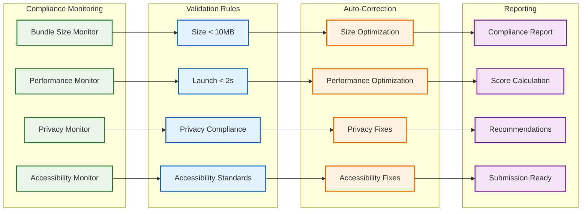

## 📊 Real-World Use Case Flows

### E-commerce App Clip Flow
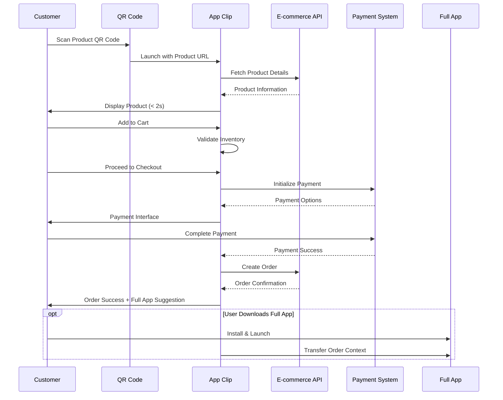

### Restaurant Ordering Flow
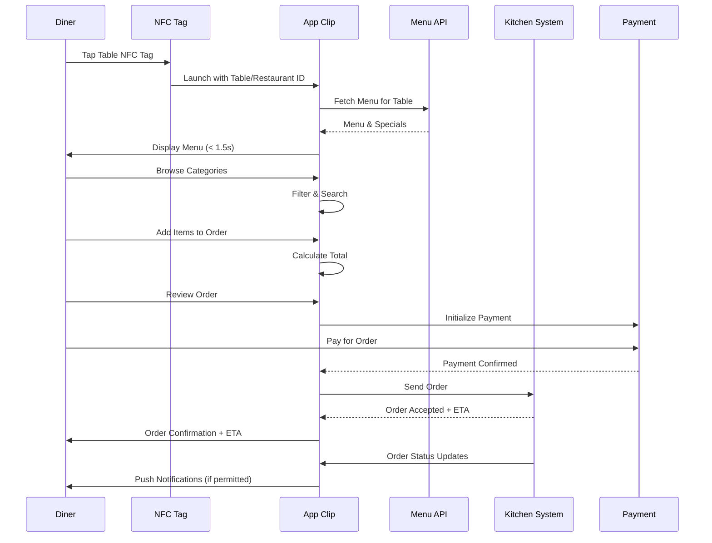

---

## 🎨 Visual Design Guidelines

### Color Coding System
- **🟢 Green**: Core framework and successful states
- **🔵 Blue**: Processing and data operations
- **🟠 Orange**: Constraints and optimization
- **🔴 Red**: Security and error handling
- **🟣 Purple**: UI and user experience
- **🟡 Teal**: Storage and persistence

### Architectural Patterns
1. **Modular Architecture**: Clear separation of concerns across 8 modules
2. **Constraint-Driven Design**: All components respect App Clip limitations
3. **Resource-Aware**: Continuous monitoring of bundle size, memory, and performance
4. **User-Centric**: Optimized for sub-2-second launch and seamless experience
5. **Integration-Ready**: Designed for easy iOS ecosystem integration

### Symbol Legend
- **Rectangles**: System components and modules
- **Diamonds**: Decision points and validations
- **Circles**: Events and user interactions
- **Hexagons**: External systems and integrations
- **Parallelograms**: Data storage and processing

---

## See Also

- [AppClipCore API Reference](../API/AppClipCore.md)
- [Performance Optimization Guide](../Performance/Optimization.md)
- [App Store Guidelines](../AppStore.md)
- [Integration Patterns](../Integration.md)
- [Security Architecture](../Security.md)