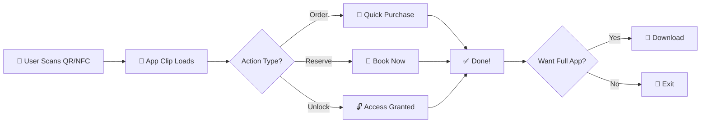

```
 █████╗ ██████╗ ██████╗      ██████╗██╗     ██╗██████╗ ███████╗
██╔══██╗██╔══██╗██╔══██╗    ██╔════╝██║     ██║██╔══██╗██╔════╝
███████║██████╔╝██████╔╝    ██║     ██║     ██║██████╔╝███████╗
██╔══██║██╔═══╝ ██╔═══╝     ██║     ██║     ██║██╔═══╝ ╚════██║
██║  ██║██║     ██║         ╚██████╗███████╗██║██║     ███████║
╚═╝  ╚═╝╚═╝     ╚═╝          ╚═════╝╚══════╝╚═╝╚═╝     ╚══════╝
                            S T U D I O
```

<p align="center">
  <strong>Build App Clips that users actually want to use.</strong>
</p>

<p align="center">
  <a href="https://swift.org"></a>
  <a href="https://developer.apple.com/ios/"></a>
  <a href="https://developer.apple.com/visionos/"></a>
  <a href="LICENSE"></a>
  <a href="https://github.com/muhittincamdali/AppClipsStudio/actions"></a>
</p>

---

## What Are App Clips?

App Clips are lightweight versions of your app (under 15MB) that users can launch instantly without installing the full app.

```
┌─────────────────────────────────────────────────────────────────┐
│                     HOW APP CLIPS WORK                          │
├─────────────────────────────────────────────────────────────────┤
│                                                                 │
│   ┌─────────┐    ┌─────────┐    ┌─────────┐    ┌─────────┐     │
│   │   📱    │    │   📷    │    │   🌐    │    │   📍    │     │
│   │   NFC   │    │   QR    │    │ Safari  │    │  Maps   │     │
│   │   Tag   │    │  Code   │    │ Banner  │    │  Link   │     │
│   └────┬────┘    └────┬────┘    └────┬────┘    └────┬────┘     │
│        │              │              │              │           │
│        └──────────────┴──────────────┴──────────────┘           │
│                              │                                  │
│                              ▼                                  │
│                    ┌─────────────────┐                          │
│                    │   App Clip      │  ← Loads in seconds      │
│                    │   Experience    │    No App Store visit    │
│                    └────────┬────────┘                          │
│                             │                                   │
│                             ▼                                   │
│                    ┌─────────────────┐                          │
│                    │  User Action    │  ← Order, Pay, Reserve   │
│                    │  Completed ✓    │                          │
│                    └────────┬────────┘                          │
│                             │                                   │
│                             ▼                                   │
│                    ┌─────────────────┐                          │
│                    │   Full App?     │  ← Optional upgrade      │
│                    │   (Optional)    │                          │
│                    └─────────────────┘                          │
│                                                                 │
└─────────────────────────────────────────────────────────────────┘
```

**Real-World Examples:**
- 🍔 Scan QR at restaurant → Order food → Pay → Done
- 🚲 Tap NFC on bike → Unlock → Ride
- ☕ Scan code at cafe → Pre-order → Skip the line

---

## Features

| Module | Description | Use Case |
|--------|-------------|----------|
| **AppClipCore** | Configuration, lifecycle, invocation handling | Every App Clip |
| **AppClipRouter** | Deep linking, URL parsing, route matching | Multi-screen clips |
| **AppClipUI** | Pre-built components, upgrade prompts | Fast prototyping |
| **AppClipAnalytics** | Event tracking, funnel analysis | Conversion optimization |
| **AppClipNetworking** | Lightweight HTTP client, caching | API calls |
| **AppClipStorage** | Keychain wrapper, UserDefaults sync | Data persistence |
| **AppClipSecurity** | Location verification, fraud prevention | Secure transactions |
| **AppClipTesting** | Mocks, simulators, snapshot tests | Quality assurance |

---

## User Flow



---

## Installation

### Swift Package Manager

```swift
dependencies: [
    .package(url: "https://github.com/muhittincamdali/AppClipsStudio.git", from: "1.0.0")
]
```

Import what you need:

```swift
import AppClipsStudio    // Full framework
import AppClipCore       // Core only
import AppClipRouter     // Deep linking
import AppClipUI         // UI components
```

---

## Quick Start

### 1. Handle Invocation

```swift
import SwiftUI
import AppClipCore

@main
struct CoffeeClip: App {
    @StateObject private var router = ClipRouter()
    
    var body: some Scene {
        WindowGroup {
            ContentView()
                .environmentObject(router)
                .onContinueUserActivity(NSUserActivityTypeBrowsingWeb) { activity in
                    guard let url = activity.webpageURL else { return }
                    router.handle(url)
                }
        }
    }
}
```

### 2. Parse URL Parameters

```swift
import AppClipRouter

class ClipRouter: ObservableObject {
    @Published var storeId: String?
    @Published var productId: String?
    
    func handle(_ url: URL) {
        // URL: https://coffee.app/clip?store=downtown&product=latte
        let params = URLParser.parse(url)
        storeId = params["store"]
        productId = params["product"]
    }
}
```

### 3. Verify Location (Optional)

```swift
import AppClipSecurity

func verifyUserLocation() async {
    let verifier = LocationVerifier()
    
    do {
        // Confirm user is actually at the store
        let isValid = try await verifier.verify(
            latitude: 37.7749,
            longitude: -122.4194,
            radius: 100 // meters
        )
        
        if isValid {
            // Proceed with transaction
        }
    } catch {
        // Handle verification failure
    }
}
```

### 4. Prompt Full App Download

```swift
import AppClipUI
import StoreKit

struct CheckoutView: View {
    @State private var showUpgrade = false
    
    var body: some View {
        VStack {
            // Checkout UI...
            
            Button("Get Full App for Rewards") {
                showUpgrade = true
            }
        }
        .appStoreOverlay(isPresented: $showUpgrade) {
            SKOverlay.AppClipConfiguration(position: .bottom)
        }
    }
}
```

---

## Size Optimization

App Clips must be under **15MB** (was 10MB before iOS 16). Here's how to stay lean:

### Size Budget

```
┌────────────────────────────────────────────────┐
│              15MB BUDGET BREAKDOWN             │
├────────────────────────────────────────────────┤
│                                                │
│  ████████████░░░░░░░░  Code & Frameworks  6MB  │
│  ██████░░░░░░░░░░░░░░  UI Assets          3MB  │
│  ████░░░░░░░░░░░░░░░░  Images             2MB  │
│  ███░░░░░░░░░░░░░░░░░  Fonts              1.5MB│
│  ██░░░░░░░░░░░░░░░░░░  Buffer             2.5MB│
│                                                │
│  Total: 15MB                                   │
│                                                │
└────────────────────────────────────────────────┘
```

### Tips

| Strategy | Impact | How |
|----------|--------|-----|
| **Use SF Symbols** | -2MB | Replace custom icons with system symbols |
| **Compress images** | -1MB | Use HEIC format, remove metadata |
| **No third-party SDKs** | -3MB | Firebase alone is 4MB+ |
| **Asset catalogs** | -0.5MB | Let Xcode optimize delivery |
| **Dead code stripping** | -1MB | Enable `-dead_strip` linker flag |
| **Bitcode disabled** | -0.3MB | Not needed for App Clips |

### Check Your Size

```bash
# Build for release
xcodebuild -scheme MyAppClip -configuration Release archive

# Check thinned size
xcrun lipo -info MyAppClip.app/MyAppClip
```

---

## QR Code Generation

Generate App Clip codes for physical placement:

```swift
import AppClipCore
import CoreImage

func generateClipCode(for url: URL) -> UIImage? {
    guard let data = url.absoluteString.data(using: .utf8),
          let filter = CIFilter(name: "CIQRCodeGenerator") else {
        return nil
    }
    
    filter.setValue(data, forKey: "inputMessage")
    filter.setValue("H", forKey: "inputCorrectionLevel") // High error correction
    
    guard let ciImage = filter.outputImage else { return nil }
    
    let scale = UIScreen.main.scale * 10
    let transform = CGAffineTransform(scaleX: scale, y: scale)
    let scaledImage = ciImage.transformed(by: transform)
    
    return UIImage(ciImage: scaledImage)
}

// Usage
let clipURL = URL(string: "https://appclip.coffee.app/order?store=123")!
let qrCode = generateClipCode(for: clipURL)
```

---

## Project Structure

```
AppClipsStudio/
├── Sources/
│   ├── AppClipsStudio/      # Main umbrella framework
│   ├── AppClipCore/         # Invocation, lifecycle
│   ├── AppClipRouter/       # URL handling, deep links
│   ├── AppClipUI/           # SwiftUI components
│   ├── AppClipAnalytics/    # Event tracking
│   ├── AppClipNetworking/   # HTTP client
│   ├── AppClipStorage/      # Keychain, persistence
│   ├── AppClipSecurity/     # Location verification
│   └── AppClipTesting/      # Mocks, test utilities
├── Tests/
│   ├── UnitTests/
│   ├── IntegrationTests/
│   └── PerformanceTests/
├── Examples/                 # Sample App Clips
└── Documentation/            # Guides
```

---

## Examples

Check the `Examples/` folder for complete implementations:

- **CoffeeOrderClip** — Restaurant ordering flow
- **BikeShareClip** — Vehicle unlock via NFC
- **EventTicketClip** — Ticket purchase and wallet integration

---

## Requirements

| Platform | Minimum Version |
|----------|-----------------|
| iOS | 16.0+ |
| macOS | 13.0+ (dev tools) |
| watchOS | 9.0+ |
| visionOS | 1.0+ |
| Swift | 5.9+ |

---

## Contributing

1. Fork the repo
2. Create your feature branch (`git checkout -b feature/awesome`)
3. Commit changes (`git commit -m 'Add awesome feature'`)
4. Push (`git push origin feature/awesome`)
5. Open a Pull Request

See [CONTRIBUTING.md](CONTRIBUTING.md) for detailed guidelines.

---

## License

MIT License. See [LICENSE](LICENSE) for details.

---

<p align="center">
  <sub>Built for developers who ship fast.</sub>
</p>
